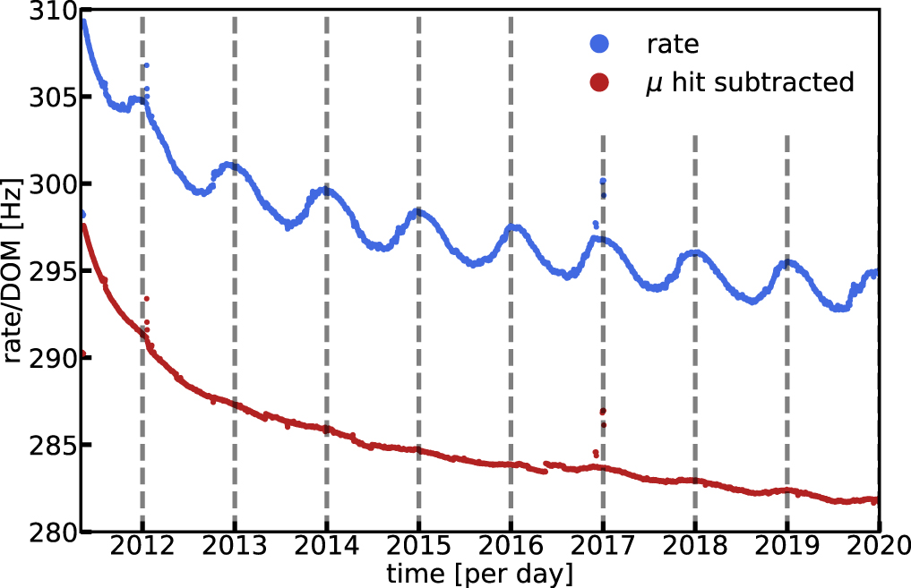

.. _overview:

Overview of the Supernova DAQ
=============================

The baseline behavior of SNDAQ is to search for a significant deviation in the
collective DOM hit rates from the expected rate of background-only hits. SNDAQ
compares the instantaneous hit rate across the detector to the collective
average DOM rate computed with a 10-minute sliding window.

IceCube Hit Rate
----------------

The individual hit rates of the DOMs,

.. math::

  R_i, \qquad i=1, \ldots, N_\mathrm{DOM},

are measured online with 2 ms resolution. The average hit rates are above 500
Hz per DOM, which is reduced to 280 Hz after the application of an artificial
deadtime. The DOM rates exhibit season variations of 30 Hz due to muons
interacting in the detector. The muon correlation can be measured and removed.

  
  DOM hit rates showing seasonal effect (blue curve) and after the seasonal
  effect is removed using the in-ice muon rate (red curve).

For neutrino energies below 1 GeV, the signal is dominated by backgrounds due
to radioactive decays in the DOM glass and triboluminescence in the ice. The
dominant neutrino interaction below 100 MeV is caused by inverse beta decay,

.. math::

  \bar{\nu}_e + p \to n + e^+.

The signal hit rate per DOM from this process is

.. math::

  \begin{align*}
  R(t) &= \epsilon_\mathrm{dead~time}
  \frac{n_\mathrm{target}\mathcal{L}^\nu_\mathrm{SN}(t)}{4\pi d^2\langle E_\nu(t)\rangle}
  \int_0^\infty dE_{e^+}
  \int_0^\infty dE_{\nu}
  \\
  &\qquad
  \times
  \frac{d\sigma}{dE_{e^+}}(E_{e^+}, E_\nu)\ V_{e^+}^\mathrm{eff}\
  f(E_\nu, \langle E_\nu\rangle, \alpha_\nu, t),
  \end{align*}

where :math:`n_\mathrm{target}` is the density of protons in ice, :math:`d` is
the distance to the supernova, :math:`\mathcal{L}^\nu_\mathrm{SN}(t)` is the
supernova neutrino luminosity, and :math:`f(E_\nu,\langle
E_\nu\rangle,\alpha_\nu,t)` is the normalized neutrino energy distribution
depending on the average neutrino energy :math:`\langle E_\nu\rangle` and
spectrum shape parameter :math:`\alpha_\nu`. The quantity :math:`d\sigma/dE` is
the differential cross section for producing a positron of energy
:math:`E_{e^+}` from a neutrino of energy :math:`E_\nu` interacting via inverse
beta decay. The effective volume for a single positron is
:math:`V_{e^+}^\mathrm{eff}`.

The SNDAQ Likelihood
--------------------

The best-fit collective change in hit
rates, :math:`\Delta\mu`, is computed by maximizing the likelihood

.. math::

  \mathcal{L}(\Delta\mu) = \prod_{i=1}^{N_\mathrm{DOM}}
  \frac{1}{\sqrt{2i\pi}\langle\sigma_i\rangle}
  \exp{
    \left(
      -\frac{(R_i - (\langle R_i\rangle + \epsilon_i\Delta\mu))^2}{2\langle\sigma_i\rangle^2}
    \right)
  },

where :math:`\epsilon_i` is the relative efficiency of DOM *i* and
:math:`\langle\sigma_i\rangle` is the variance of the hit rate estimated in DOM
*i* in the sliding window.

The maximum likelihood estimator of :math:`\Delta\mu` is

.. math::

  \Delta\mu = \sigma^2_{\Delta\mu} \sum_i^{N_\mathrm{DOM}} \frac{\epsilon_i(R_i - \langle R_i\rangle)}{\langle\sigma_i\rangle^2}

with estimated uncertainty

.. math::

  \sigma_{\Delta\mu}^2 = \left(\sum_i^{N_\mathrm{DOM}} \frac{\epsilon_i^2}{\langle\sigma_i\rangle^2} \right)^2.

The SNDAQ Test Statistic 
------------------------

The signficance of the collective rise :math:`\Delta\mu` is expressed in terms
of a test statistic

.. math::

  \mathrm{TS} = \xi = \frac{\Delta\mu}{\sigma_{\Delta\mu}},

which is the ratio of the estimated collective rate increase divided by the
uncertainty in the estimator. The test statistic is estimated in time windows
lasting 0.5 s, 1.5 s, 4.0 s, and 10.0 s, which are optimized for various
core-collapse scenarios.

SNDAQ sends out a variety of public and private alerts when TS exceeds a set of
preprogrammed thresholds (see the escalation scheme on **THIS PAGE**). There is
a strong seasonal effect observed that produces a tail of high TS values during
the austral summer, when the atmosphere is less dense and the muon rate in
IceCube increases. We zero out this effect by measuring the muon rate online
and de-trending TS in real time to produce a corrected test statistic

.. math::

  \mathrm{TS_corr} = \xi'.

A value of :math:`\xi'>6` occurs by chance less than once per year.

Bayesian Blocks Trigger
-----------------------

An additional calculation based on the Bayesian Blocks algorithm is run in real
time on the SNDAQ hit stream. The Bayesian Blocks calculation constructs a
piecewise-constant approximation of the hit rate and reports statistically
significant changes in the rate. Unlike the SNDAQ likelihood, this calculation
is independent of underlying assumptions about particular supernova models. It
is not currently used to trigger SNDAQ alerts, but is saved in the SNDAQ output
stream.
